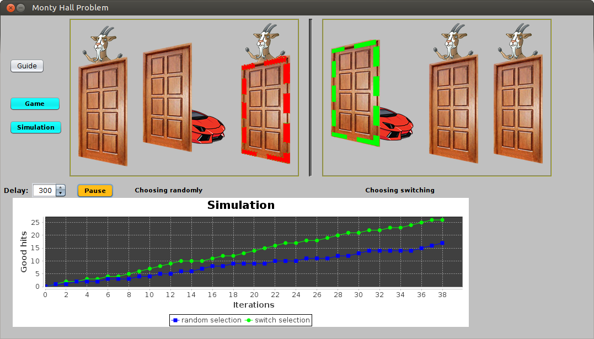

# Monty Hall Problem simulation

## The problem
[Monty Hall Problem](https://en.wikipedia.org/wiki/Monty_Hall_problem "Monty Hall Problem")

## Synopsis
A visual simulation + little game to help understand and raise awareness to simple,
yet useful probability calculations.

## Copyright
The software is provided as-is, do freely whatever you wish with it.
